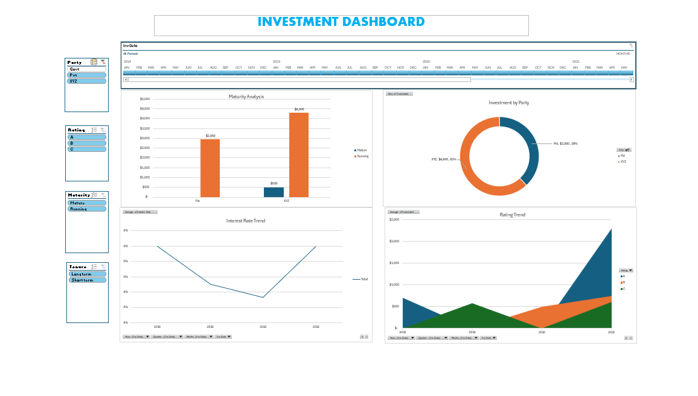

# Investment Analysis Dashboard

## 📊 Project Overview

This project is an interactive Investment Analysis Dashboard created using Microsoft Excel.

The dashboard provides a visual analysis of investments based on Party, Rating, Maturity, Tenure, Interest Rate, and Investment Date.

## 🛠️ Tools & Technologies

- Microsoft Excel
- Pivot Tables
- Pivot Charts
- Slicers
- Data Visualization

## 📈 Dashboard Features

- Investment by Party
- Maturity Analysis
- Interest Rate Trend
- Rating Trend
- Investment Date Filter
- Party Filter
- Rating Filter
- Maturity Filter
- Tenure Filter

## 🎯 Objective

The objective of this project is to analyze investment data and present important trends and distributions through an interactive Excel dashboard.

## 🖼️ Dashboard Preview

## 👨‍💻 Project Type

Beginner Data Analytics Project
